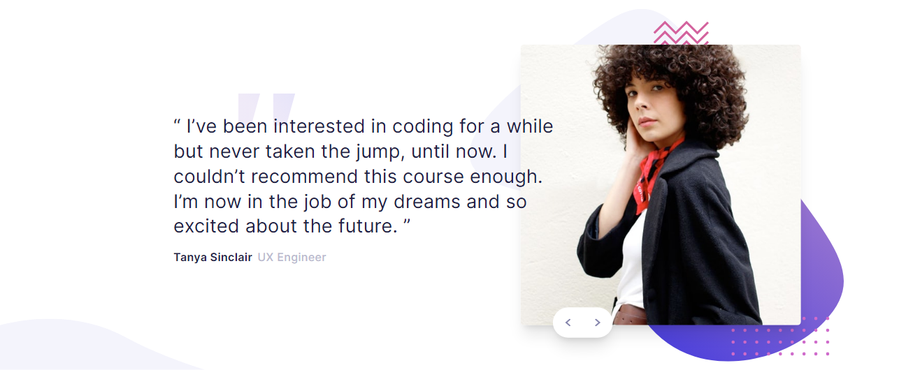
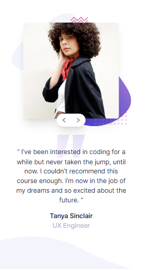

# Frontend Mentor - Coding bootcamp testimonials slider solution

This is a solution to the [Coding bootcamp testimonials slider challenge on Frontend Mentor](https://www.frontendmentor.io/challenges/coding-bootcamp-testimonials-slider-4FNyLA8JL). Frontend Mentor challenges help you improve your coding skills by building realistic projects. 

## Table of contents

- [Overview](#overview)
- [The challenge](#the-challenge)
- [Screenshot](#screenshot)
- [Links](#links)
- [My process](#my-process)
- [Built with](#built-with)
- [Author](#author)

## Overview

### The challenge

Users should be able to:

- View the optimal layout for the component depending on their device's screen size
- Navigate the slider using either their mouse/trackpad or keyboard

### Screenshot

### Links

- Solution URL: [Github](https://github.com/JuanMiranda1998/bootcamp-testimonials-frontend-mentor)
- Live Site URL: [Netlify](https://www.example.com)

## My process

### Built with

- Semantic HTML5 markup
- CSS custom properties
- Flexbox
- Mobile-first workflow
- [React](https://reactjs.org/)
- [TailwindCSS](https://tailwindcss.com/) 

## Author

- Frontend Mentor - [@JuanMiranda1998](https://www.frontendmentor.io/profile/JuanMiranda1998)
- Twitter - [@juan__miranda__](https://twitter.com/juan__miranda__)